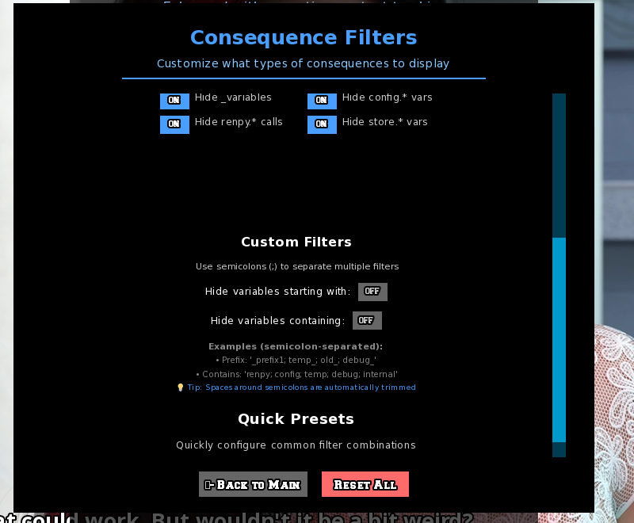
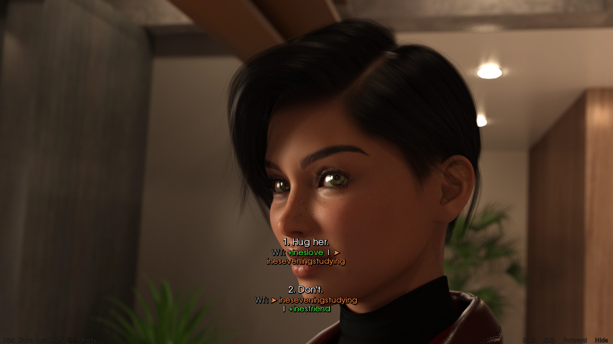

# Universal Ren'Py Walkthrough System

[](https://www.renpy.org/)
[](LICENSE)
[](../../releases/latest)

A universal walkthrough mod that automatically shows choice consequences for **ANY** Ren'Py game - no manual setup required!

## ✨ Features

- 🎯 **Universal Compatibility** - Works with ANY Ren'Py game without modification
- 🔍 **Smart Analysis** - Automatically detects variable changes, jumps, and consequences
- 💾 **Compiled Game Support** - Works even with compiled (.rpyc) games
- ⚡ **Performance Optimized** - Smart caching and memory management
- 🎨 **Customizable** - Adjustable text size and display options
- 🔧 **Zero Setup** - Just drop the file and play
- 🚫 **Non-Intrusive** - Doesn't modify game files or save data

## 🚀 Quick Start

1. **Download:** Get [`__urw.rpy`](__urw.rpy) from [releases](../../releases/latest)
2. **Install:** Drop it in your game's `game/` folder
3. **Play:** Press `Alt+W` in-game for settings

📖 **Need help?** See the [detailed installation guide](installation.md)

## 📸 Screenshots




### Before (Normal Menu):
```
What should I do?
> Talk to Sarah
> Go to class
> Skip school
```

### After (With Walkthrough):
```
What should I do?
> Talk to Sarah          [+love_sarah, +trust]
> Go to class           [+grades, +reputation] 
> Skip school           [-reputation, jump party_scene]
```

## 🎮 Compatibility

### ✅ Tested & Working:
- **Ren'Py 8.x.x** engines (latest versions)
- **Compiled games** (.rpyc files)
- **Windows, Mac, Linux**

### 📝 Tested Games:
Help us expand this list! [Report compatibility](../../issues/new?template=compatibility_report.md)

| Game | Version | Status | Notes |
|------|---------|--------|-------|
| *Your game here* | | | [Test and report!](../../issues/new) |

## ⚙️ Usage

### Controls:
- **Alt+W** - Open walkthrough settings
- Settings also available in game preferences

### What You'll See:
- **Variable changes:** `[+love_sarah, -trust_john]`
- **Scene jumps:** `[→ party_scene]`
- **Function calls:** `[call morning_routine]`
- **Conditional outcomes:** `[if money >= 100: +expensive_date]`

## 🐛 Troubleshooting

**Quick fixes:**
- Ensure `__urw.rpy` is in the `game/` folder (not main folder)
- Press `Alt+W` to check if mod loaded
- Enable debug mode in the file if issues persist

📖 **Full troubleshooting:** See [installation guide](installation.md#troubleshooting)

## 🛠️ Development

### How It Works:
1. **Menu Interception** - Hooks into Ren'Py's menu system
2. **Code Analysis** - Parses choice destinations for consequences
3. **Smart Caching** - Stores analysis results for performance
4. **Display Integration** - Shows results in menu UI

### Contributing:
We welcome contributions!

[View full changelog](CHANGELOG.md)

## 🏗️ Roadmap

### Planned Features:
- [ ] More detailed consequence analysis
- [ ] Localization support
- [ ] Custom styling options
- [ ] Save/load walkthrough preferences

## 📄 License

This project is licensed under the MIT License - see the [LICENSE](LICENSE) file for details.

## 🙏 Acknowledgments

- **Ren'Py Team** - For the amazing visual novel engine
- **Community** - For testing and feedback
- **Game Developers** - For creating great Ren'Py games

## 🌟 Support the Project

If this mod helped enhance your gaming experience:
- ⭐ **Star this repository**
- ⭐ **Watch** for updates
- 🐛 **Report bugs** to help improve it
- 💬 **Share** with other Ren'Py players
- 🔧 **Contribute** code or documentation

---

**Made with ❤️ for the Ren'Py community**

*Universal compatibility • Works with compiled games*